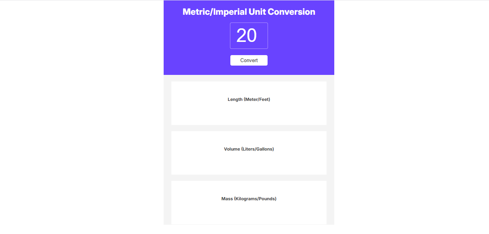

# Unit Converter

A simple and elegant unit converter that handles conversions between metric and imperial units. The application converts:
- Length (Meters/Feet)
- Volume (Liters/Gallons)
- Mass (Kilograms/Pounds)



## Live Demo

Check out the live demo: [Unit Converter](https://unit-converter-kain.netlify.app/)

## Features

- Clean and responsive user interface
- Real-time conversion between metric and imperial units
- Results rounded to three decimal places
- Handles multiple unit conversions simultaneously
- Modern design with a user-friendly interface

## Technologies Used

- HTML5
- CSS3
- JavaScript
- Google Fonts (Inter)

## Conversion Rates Used

- Length: 1 meter = 3.2803 feet
- Volume: 1 liter = 0.2642 gallons
- Mass: 1 kilogram = 2.2046 pounds

## Getting Started

1. Clone the repository:
```bash
git clone https://github.com/your-username/unit-converter.git
```

2. Open `index.html` in your browser to run the application locally.

## Project Structure

```
unit-converter/
│
├── index.html
├── index.css
├── index.js
└── README.md
```

## Learning Context

This project was completed as part of the JavaScript section in the [Scrimba Fullstack Developer Career Path](https://scrimba.com/fullstack-path-c0fullstack). It demonstrates practical implementation of:

- DOM manipulation
- Event handling
- Functions
- Template literals
- Number formatting

## Contributing

Feel free to fork this project and submit pull requests for any improvements.